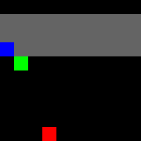

# Reinforcement Learning: Solving MinAtar Games Using Deep Q-Learning

This project implements Deep Q-Networks to solve CartPole and Breakout, a classic game from MinAtar. We follow the paper of Mnih et al. (2013) and the Reinforcement Learning (DQN) Tutorial. We also used the explanations from https://www.youtube.com/watch?v=nOBm4aYEYR4.  
The project presents two DQN Agents, each one capable of solving one of the two games. We also provide several metrics to assess their efficiency.

## Project Objectives

1. Implement a Deep Q-Learning Agent using PyTorch  
2. Explain how DQN Agents work  
3. Train and evaluate on the CartPole environment  
4. Train and evaluate on the Breakout environment from MinAtar  

## Why DQN

DQN is a type of neural network capable of estimating the Q-function. This function is useful in order to achieve the optimal (or closest to optimal) policy, which allows the Agent to solve these types of games efficiently.

## Implementation

In this project, we implemented a first Agent using a Multi-Layer Perceptron neural network to solve the CartPole environment, and a second Agent using a Convolutional Neural Network to solve the Breakout environment from MinAtar.

## Metrics

Tracked metrics:
- Total reward per episode  
- Average maximum Q-value over fixed states  
- Q-value evolution during evaluation episodes  
- Directional bias (CartPole)  

## Content of the Repository

```
.
├── README.md                    # Project overview and usage instructions
├── REPORT.md                    # Theoretical background and analysis
├── CartPole.ipynb               # CartPole experiments (MLP-based DQN)
├── Breakout.ipynb               # MinAtar Breakout experiments (CNN-based DQN)
├── images_cartpole/             # CartPole results and visualizations
└── images_breakout/             # Breakout results and visualizations
```
## Usage

Run the two Python notebooks independently to build and train the two Agents.

## Results

From the first GIF, we see that the Agent reaches a reward greater than 200, meaning that it can maintain the pole balanced for more than 200 actions.

**Best parameters (CartPole):**

- Batch size: 128
- Discount factor (γ): 0.99
- Initial exploration rate (ε start): 0.9
- Final exploration rate (ε end): 0.01
- Exploration decay: 2500
- Target network update rate (τ): 0.005
- Learning rate: 3 × 10⁻⁴
- Number of training episodes: 500


From the second GIF, we see that the Agent is able to obtain a fairly high score, breaking almost 75% of the blocks.

**Best parameters (Breakout):**

- Batch size: 64
- Discount factor (γ): 0.99
- Initial exploration rate (ε start): 1.0
- Final exploration rate (ε end): 0.01
- Exploration decay: 5000
- Target network update rate (τ): 0.01
- Learning rate: 1 × 10⁻³
- Replay memory capacity: 20,000
- Number of training episodes: 2000



In both cases, we observed that increasing the number of episodes improves the Agents’ performance, at the cost of longer training time.

## Dependencies

This project relies on the following libraries:

- PyTorch  
- Gymnasium  
- MinAtar  
- NumPy  
- Matplotlib  
- Pillow  
- ImageIO  
- IPython  

Standard Python libraries such as `math`, `random`, `collections`, and `itertools` are also used.

### Installation

```bash
pip3 install gymnasium[classic_control]
pip install minatar
```
## References
-Mnih, V., Kavukcuoglu, K., Silver, D., Graves, A., Antonoglou, I., Wierstra, D., & Riedmiller, M. (2013). Playing Atari with Deep Reinforcement Learning. arXiv preprint arXiv:1312.5602. https://doi.org/10.48550/arXiv.1312.5602
-PyTorch Team. Reinforcement Learning (DQN) Tutorial. PyTorch Official Documentation. https://docs.pytorch.org/tutorials/intermediate/reinforcement_q_learning.html
-Olekhnovich, S. Walking Through the Original DQN Paper. Medium. https://stas-olekhnovich.medium.com/walking-through-original-dqn-paper-af064a5cbe4f
-Kilcher, Y. What is Q-Learning (Back to Basics). YouTube. https://www.youtube.com/watch?v=nOBm4aYEYR4

### License
This project is provided as-is for educational and research purposes.

### Author

Martin Mondelli

**Last Updated:** January 2026
