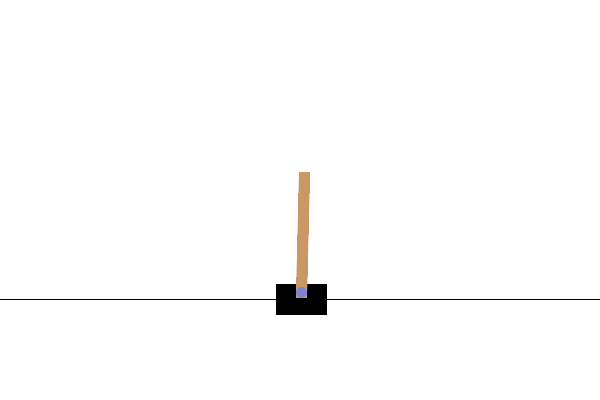
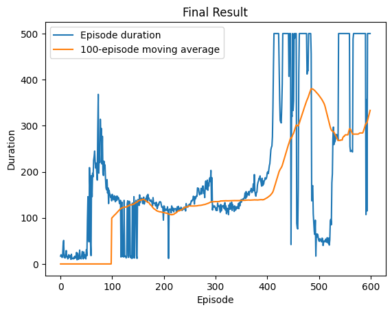
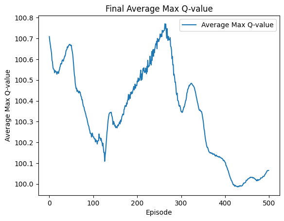
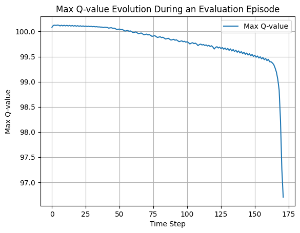

# Report on Reinforcement Learning: Solving MinAtar games using Deep Q-Learning

In this project we implemented a Deep Q-learning algorithms in reinforcement learning context. We developped two DQN agents, one able to play the CartPole game and the other Breakout from Minatar. In both cases we developped the agents from scratch. The first one is based on a script from the Reinforcement Learning (DQN) Tutorial but adapted in order to make it understandable for users that are not well familiarized with DQNs. The second agent, the one for Minatar, uses a similar way of scripting as the tutorial but instead of using a Multi-Layer Perceptron (MLP), we use a Convolutional Neural Network (CNN) to make the script more closer to the support paper of Mnih et al. (2013).

## Main contributions of the paper Mnih et al. (2013)

1. Implementation of Experience Replay
2. Using a Neuronal Network for the target
3. Using CNN for Atari 2600 games (and in general for inputs that are images) in order to estimate the Q function

## About Deep Q-learning

First, we will begin by explaining the mathematical foundations and working of Deep Q-learning, in other words, the theoretical explanation.

### Main idea

Q-learning is included in Reinforcement Learning (RL). The idea of RL is to make an Agent (a virtual robot) interact with an Environment (here a game). The goal of the Agent is to perform well in the game. This is done through a system of rewards, where the Agent receives a certain reward for good actions. The goal of the Agent is to maximize this reward: $$R_T = \sum_{t'=t}^T \gamma^{t'-t} r_{t'}$$ where $$\gamma$$ is the discount factor and r() is the reward at each perior. A key factor is that the Agent is not given any prior training or strategy in the game, it is up to it (thorugh interactions with the environment) to learn the best strategy it can.

In the context of Q-learning, what the Agent observes is an adaptation of the State "s", this is similar to a processed picture of what is happening in the Environment at time t. One of the innovations of the paper of Mnih et al. (2013) is the Memory Replay, which gives the Agent more information about the previous states, we will develop this further in the next sections.

The center of this method is no other than estimating the $$Q_{\pi}(s,a)$$ function, which receives input "s" and a possible action "a" that belongs to a set of possible actions A. This is a function that, in a current state s, gives the Agent the total reward following action a, given that it will follow a certain policy (strategy) $$\pi$$ afterwards.  

Thus, we can separate this Q function in two part, the present (inmediate) reward r in i and the following reward in i+t $$\pi$$. This relation is given in the Bellman's equation. Note that there are two reasons why a certain action $$a_1$$ might give a higher value for Q than antoher action $$a_2$$. On the one hand, it can give an inmediate higher reward. On the other hand, it can also be that because after undertaking either of those actions we end up in a different state $$s_2$$ or $$s^'_2 where even if we followed the same policy afterwards we will not be able to reach the same amount of total reward.

Now, if we had the function Q, then it would be obvious that the only optimal policy in $$s_i$$ would be the one that maximizes Q this is: $$\pi_Q(s) = max_a Q(s,a)$$ at every state: the solution would be trivial. The problem is that we do not know the function Q. **Thus, the main idea would be to estimate Q**.

There are two main ways of doing so: either in a parametric way, meaning that we suppose the shape of Q and we estimate its parameter $$\theta$$ or we can use Deep Neural Networks. The latter is known as DQN.

## About the Bellman equation

Since we use stochastic gradient descent (SGD) and mini-batches, we start from the Bellman optimality equation for the action-value function:

$$
Q^{Optimal}(s,a) = \mathbb{E}[r + \gamma \max_{a'} Q^{Optimal}(s', a')]
$$

where the expectation is over the next state $s'$ given the current state-action pair $(s,a)$.

In practice, this expectation is approximated using a single sampled transition. Therefore, we use the following sample-based update:

$$
Q^{Optimal}(s,a) = r + \gamma \max_{a'} Q^{Optimal}(s', a')
$$

## What was done in the past

In previous works what was done is to do iterations or assume a parametric form of Q, in the paper of Mnih et al. (2013) they propose to estimate it using Neural Networks.

## Important remarks

The model does not know the real behavior of E (like the physics in  CartPole) it only knows a set: ($$s_{t-1}$$, $$a_t$$, r, $$s_{t}$$) for which a certain number of them (M) are stored in the Replay Memory.

The model tries to explore new actions even if they are not meant to be done in the policy, this is call off-policy and what it is trying to do is to learn new behaviors that might give higher rewards.

The Replay Memory is a dataset containing all previous states. 

## About the DQN

The idea of DQN is that the Neural Network approximates the optimal action-value function by minimizing the loss function

$$
L_i(\theta_i) = \mathbb{E}\left[\left( y_i - Q(s,a;\theta_i) \right)^2\right]
$$

where

$$
y_i = r + \gamma \max_{a'} Q(s',a';\theta_{i-1})
$$

This target value is derived from the Bellman optimality equation and represents the one-step approximation of the optimal Q.  

When minimizing the loss with respect to the weights, we get at the following gradient:

$$
\nabla_{\theta_i} L_i(\theta_i) =
\mathbb{E}\left[\left(r + \gamma \max_{a'} Q(s',a';\theta_{i-1}) - Q(s,a;\theta_i)\right)
\nabla_{\theta_i} Q(s,a;\theta_i)\right]
$$

When using Stochastic Gradient Descent (SGD), the expectation term can be approximated by computing the gradient over a finite minibatch of samples.

The model is updated at each time step, where a time step corresponds to a single interaction between the agent and the environment: the agent observes the current state, selects an action, receives a reward, and transitions to a new state. Each observed transition $(s_t, a_t, r_t, s_{t+1})$ is stored in a Replay Memory buffer.

### Why SGD?

The main problem in previous works is that when training, the states where quite similars. This is due to the fact that, for example, when training CartPole, if the Agent moved the pole to the left multiple times and it gave a reward, it will probably continue to make the action to go to the left again. However, at some point if it only did Left, it will fall. Instead of training the network using only the most recent transition, a random minibatch of transitions is sampled from the replay memory at every time step to perform a gradient descent update. By using this procedure, the model avoids strong correlations between consecutive and similar states. Moreover, it allows previously observed transitions to be reused multiple times, improving data efficiency and making the training process more stable.

### ε-greedy policy

Each time the model takes an action, it follows an $\varepsilon$-greedy policy: with probability $\varepsilon$ a random action is selected to explore new actions instead of the one that we think maximizes Q, and with probability $1-\varepsilon$ the action with the highest estimated Q-value is chosen according to the current network parameters.

Since the transitions sampled from the Replay Memory may have been generated by older policies, the learning process is off-policy, which justifies the use of Q-learning in the DQN framework.

## Setting

The idea of the procedure is quite easy: the Agent takes an action, the Environment gives it the Picture (which is then processed by the CNN) $$x_t$$ and a reward r.

The optimal action-value function Q we want is: $$Q^*(s,a) = \max_{\pi} \; \mathbb{E} \left[ \sum_{t=0}^{\infty} \gamma^t r_t \;\middle|\; s_0 = s,\; a_0 = a,\; \pi \right]$$.

What the Agent really sees is a State $$s_t = ((x_1,a_1),(x_2,a_2),.....,(x_{t-1},a_{t-1}), x_t)$$

## Explanation of the general Algorithm

### The algorithm

In the paper Mnih et al. 2013 the algorithm is as follows:

First, they **initialize a buffer for the replay memory with capacity N** and the Q function with random weights. 

Second, they use an outer loop for M episodes that gives the real state (the image) of the game, they call that $$x_t$$ and **they use a CNN to feed it to the model**. 

Third, in an inner loop for t in 1 to T times, the Agent will choose with probability $$\epsilon$$ a random action $$a_t$$ and with probability $$1-\epsilon$$ the action that maximizes the Q function based on state $$s_t$$. Then, the environment will yield a reward $$r_t$$ and the new state $$s_{t+1}$$. **Following that, they store the processed image of state, the reward and the action in t and the new processed state in t+1 in the memory replay**. Finally, they take a mini-batch randomly from the memory replay, compute the target y and perform a gradient descent. 

The elements that are in bold are the ones that correspond to the innovation of the paper.

### Some remarks of implementation

In order to have a more stable process we initialize two neural networks: one for the policy and the second for the target, both of them are initialized at the beginning and updated at each episode. The first one, the policy, is updated first in a function called "optimize_model" which updates the weights using the minibatch sample from the replay memory. The second one, the target, is updated afterwards, without any backpropagation and learns at a small rate from the policy and at a bigger rate from its previous value. This update method is called soft update and it differs from what the authors did in the paper Mnih et al. 2013. In the paper they updated the target network less frequently.

The reason behind using a neural network for the target is only for computational reasons. In fact, because the policy is a neural network and the target depends on the policy network’s outputs, using a neural network for the target ensures that the target can compute the Q-values consistently.

## Metrics

1. Episode Duration (Total Reward):
Purpose: Measures the total reward collected by the agent in an episode

2. Average Maximum Q-value for Fixed States:
Purpose: Provides a more stable and less noisy measure of the policy network's learning progress and confidence by tracking the average of the highest predicted Q-values for a fixed set of states.

3. Maximum Q-value Evolution During an Evaluation Episode:
Purpose: Visualizes how the agent's estimated value for the current state (its maximum predicted Q-value) changes over time within a single evaluation episode. This helps in understanding the agent's perception of value fluctuations.

4. Directional Fall Evaluation:
Purpose: Specifically for CartPole and adapted for Minatar Breakout, this metric assesses if the trained policy has a bias towards the pole falling to the left or right, indicating potential imbalances in the learned control strategy.##

## CartPole 

In this section we explain in detail our approach for CartPole.  
Because the CartPole environment is represented by only four variables, we can directly apply a fully connected neural network (MLP) to approximate the Q-function. The network outputs one Q-value for each possible action.

### Metric evaluation

For the first one, we clearly see that we reach 200 reward after about 60 episodes. The curve is not smooth at all, there are plenty of peaks and drops throught the episodes. In particular, we see that the number of rewards rapidly increases at the begining but it drops quickly after the reaching the first local maximum at 80 episodes. We clearly see three highly oscillating spans in the curve, between 110 and 130 episodes, between 410 and 490 and after 550 episodes. Overall, we see that this metric is not well suited for studing the evolution of the rewards because it does not seems like the model follows a clear tendency even though we can still see a clear progression in the number of rewards with the episodes. 

The second metric is meant to understand if our policy is working correctly. In fact, we expect that our policy to be increasing with the number of episodes as the model is learning more and we take $$\epsilon = 0$$ so no place for random actions. More precisely, what we do is to take 128 states and apply only the estimated optimal policy (to take the action that maximizes the Q function) to each one. The plot shows the mean of these maximums per episode. We see in the graph that the curve is much more smoother than for the previous metric. We observe that at the begining the maximum is decreasing, this makes sense because the Agent does not know yet what are the best actions and probably it is learning more by taking random action than by following a small set of replay memory. Once it has leanrnt 110 episodes, the maximum starts increasing, meaning that now the Agent nows better when to take which action and thus is depending less on the random actions. Following the peak at 250 episodes, the maximum decreases slowly to levels below the initial maximum. This might be due to overfitting, in fact the model learnt too many episodes and thus it can no longer learn new solutions for new situations.

The third metric shows for a certain episode how the maximum of Q evolves for each time step (each action the Agent took). We clearly see a decreasing tendency, meaning that the model estimates everytime a smaller value for the maximum of Q. This means that the agent gives at each step smaller value to future actions (the policy) meaning that it will take actions that favorises in priority the current state more than the future ones. This makes the model probably more vulnerable in the future causing him to lose the game at a certain point in the episode.

Finally, the last metric shows the directional bias of the Agent. We clearly see that the Agent falled to the right in 1000 episodes meaning that there is a clear directional bias. An improvement could be made in terms of the $$\epsilon$$ and the $$\tau$$ in order to make the Agent chose arbitrarely to take more random actions forcing him to learn more situation and thus preventing him to fail always at one side. During the duration of the project, we tried multiple trainings and eventhough most of the time the Agent always falls at either of the sides. We managed to get one output where the agent falled 25% of the time to the left and 75% to the right.

For printing results please refer to the CartPole Notebook:
Falls left : 0
Falls right: 1000

## Breakout from Minatar

Following Mnih et al. (2013), for Breakout the environment provides a 2D representation of the game (pixels). Therefore, we use a convolutional neural network (CNN) to approximate the Q-function from these states.  
Our CNN consists of two convolutional layers followed by two fully connected layers with ReLU activations. This design allows the network to extract spatial features from the game frames before computing the Q-values for all possible actions, closely following the architecture described in the original DQN paper.

### Metric evaluation

For the first metric we see the same problem as for the CartPole setting, the courve oscilates a lot but it seems to be stationary. For the 1000 episodes, it seems to stagnate arround 12 rewards and for the 2000 episodes, it stagnates at 15 rewards. We clearly see a progress when increasing the number of episodes. It would be interesting to test with more episodes (likely 5000) the outcome. We did not test with more episodes due to the training time and capacity limitations. From the litterature, some examples with more episodes can be found in the blog of Stas Olekhnovich quoted in the References. 

For the second metric, we clearly see a decreacing tendency. In fact, we took 128 states and followed them for 500 episodes taking the average of the maximum of Q function and we found that the maximum increases for the first 100 episodes and then it slowly decreases. This means that at the begining, the model increases its value of the future but as the episodes increase, it starts valuating it less. This might be due to an overfitting problem or perhaps that the model has not learn yet enough about the environment to know that it might need to increase its value of the future. To solve this a fine tunning should be conducted to chose the right number of episodes.

For the third metric, we see that the value of the maximum of Q is stable at the begining of the episode but it decreases slowly afterwards to 0. This behavior is weird in the sense that the Agent seems to value future almost as nothing (close to 0). We expected this behavior to happend at when the Agent is about to break the last block because afterwards there is no future. However, from our test we did not manage to see that the Agent broke all the blocks. This means that after 100 episodes, the Agent is trying to solve current conjonctures without considering the issues it might cause in the future. The fact that it drops to 0 is even worst, our Agent might be thinking that there are almost (or none) blocks left, which obviusly leads to erratic behavior at the middle of the game. When comparing to the GIF for breakout, we see that this behavior becomes clear: in the games where the Agent manages to destroy a lot of blocks, it makes really big blounders which causes the game to end drastically. 

Finally, for the last metric that is evaluated over the last 100 episodes, the Agent has a certain directional bias in favour of the action Left but it is quite small: 52% of actions were Left against 48% which were Right. This is not surprising as the numbers are not that different but it shows that the Agent is not trained evenly to go to the right or to the left which might cause some early stopping of the episodes due to blounders. 

For printing results please refer to the Breakout Notebook:
--- Summary of directonnaly bias ---
Total 'LEFT' actions: 2091
Total 'RIGHT' actions: 1935
Ratio 'LEFT': 0.52
Ratio 'RIGHT': 0.48
The Agent seems to have a preference for the 'LEFT'.

# References

Mnih, V., Kavukcuoglu, K., Silver, D., Graves, A., Antonoglou, I., Wierstra, D., & Riedmiller, M. (2013). Playing Atari with Deep Reinforcement Learning. *arXiv preprint arXiv:1312.5602*. https://doi.org/10.48550/arXiv.1312.5602

PyTorch Contributors. (2023). Reinforcement Learning (DQN) Tutorial. PyTorch Documentation. https://docs.pytorch.org/tutorials/intermediate/reinforcement_q_learning.html

Olekhnovich, S. (2020). Walking through the original DQN paper. Medium. https://stas-olekhnovich.medium.com/walking-through-original-dqn-paper-af064a5cbe4f

